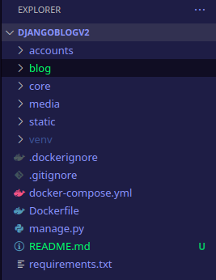
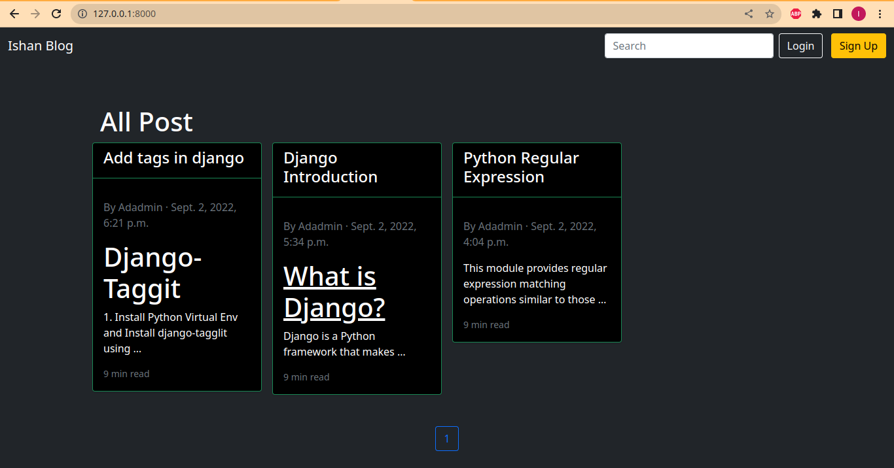
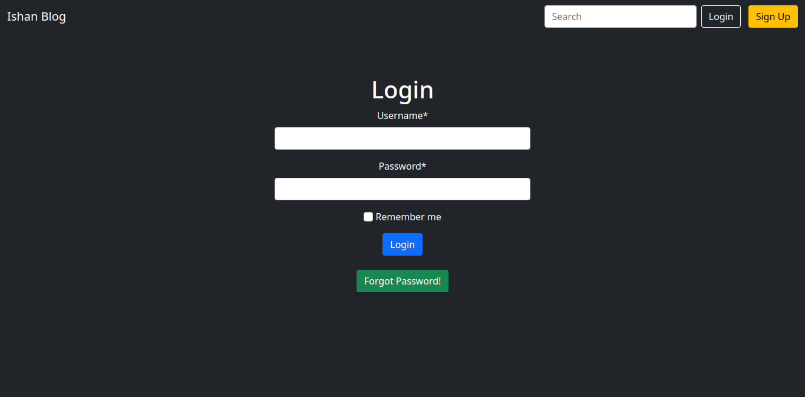
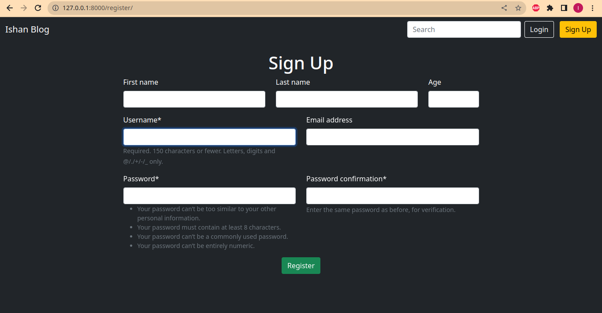
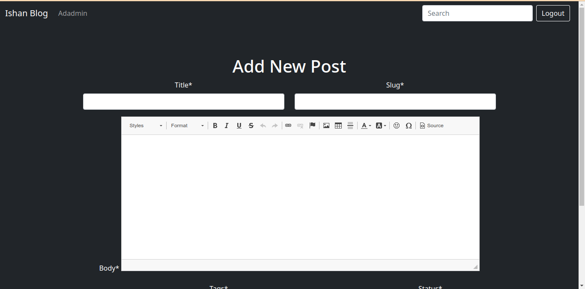
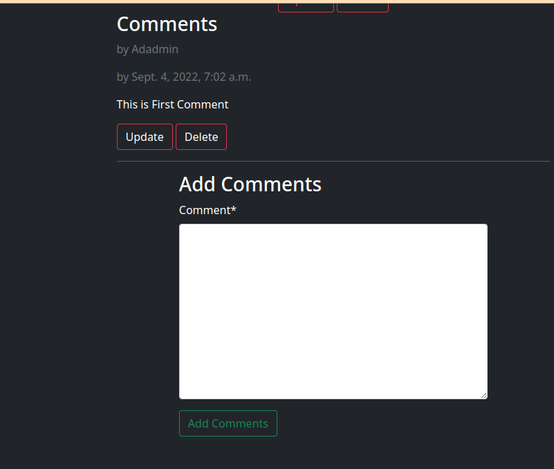

# Simple Blog Application

# Features

 1. Custom User Model
 2. Custom forms for Creating and Editing Users using UserCreationForm and UserChangeForm
 3. Login/Logout/Sign Up functionality using Class based Views
 4. Password Change Functionality
 5. Password Reset Functionality
 6. Blog Add, List, View, Update and delete functions
 7. User Specific data
 8. Add Comments
 9. Edit and Delete Comments 
 10. Permission and Authorization
 11. Add search function
 12. Add tags using taggit
 13. Show blog post accordings to tags
 14. Add custom template tags
 15. Add recommended post, lastest post and most commented post in detail view
 16. Pagonation 
 17. Integrate CKeditor


# Features to be added
 1. Pagination in Comment
 2. Update using Class based View
 
# Quick Start
To setup and run project locally on your machine then follow these simple steps
 1. Create a directory for this project and clone this project:
    ```mkdir blog```
    ```cd blog```
    ```git clone https://github.com/ishanshre/DjangoBlogV2.git .```
 2. Create a virtual env using python
    ```python -m venv venv```
 3. The project directory looks like:
    
 4. Install docker, docker-compose and docker-scan
    ```sudo pacman -S docker docker-compose docker-scan```
 5. Build and run the docker container
    ```docker-compose up -d --build```
 6. Run migrate command
    ```docker-compose exec web python manage.py migrate
 7. Run collectstatic commands
    ```docker-compose exec web python manage.py collectstatic```
 8. Create super user account
    ```docker-compose exec web python manage.py createsuperuser```
 9. Now you are good to go
    ```127.0.0.1:8000```
    
# Sample Images





